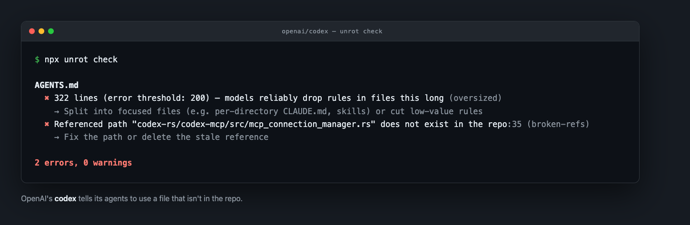

# unrot

Your agent configs rot. The repo moves on — files get renamed, scripts get replaced, conventions change — while `CLAUDE.md`, `AGENTS.md`, `.cursorrules`, and the rest quietly keep describing a codebase that no longer exists. Every session your agents start from instructions that are stale, bloated past what models actually follow, contradictory, or pointing at files that are gone. Nothing checks them.

**unrot** finds the rot: a linter for the config files that steer your AI coding agents — `CLAUDE.md`, `AGENTS.md`, `.cursorrules`, Claude Code skills and commands, MCP configs, Copilot instructions. Pure static analysis + git: no network calls, no telemetry, no LLM calls, and it never modifies your files.



## Quick start

```bash
npx unrot check
```

Zero config required. Run it at the root of any repo.

```bash
# Inventory every agent config file in the repo
npx unrot scan

# JSON output + non-zero exit on errors — works as a CI gate
npx unrot check --json
```

Or install it: `npm i -D unrot`, then run `unrot` (or `agent-config-linter` — both binaries are installed).

> Not affiliated with the separate `agentlint` npm package.

## Sample output

A real run on [cline/cline](https://github.com/cline/cline):

```
$ npx unrot check

.claude/commands/hotfix-release.md
  ⚠ 187 lines (warn threshold: 100) — long instruction files get partially ignored (oversized)
    → Tighten wording and move rarely-needed detail into referenced docs

sdk/AGENTS.md
  ⚠ 109 lines (warn threshold: 100) — long instruction files get partially ignored (oversized)
    → Tighten wording and move rarely-needed detail into referenced docs
  ✖ Referenced path "./DOC.md" does not exist in the repo:9 (broken-refs)
    → Fix the path or delete the stale reference

1 error, 2 warnings
```

## Found in the wild

From a validation run across 69 popular open-source repos (Next.js, VS Code, React, Django, prisma, storybook, supabase, zed, ollama, cline, codex, OpenHands, ...), with every error-level finding hand-verified against the repo:

- **microsoft/vscode** — the Copilot extension's `AGENTS.md` references four source files that no longer exist; for one, unrot spots the file's new location: *Did you mean "...common/skillConfigLocations.ts"?*
- **openai/codex** — `AGENTS.md:35` tells agents to use `codex-rs/codex-mcp/src/mcp_connection_manager.rs`, which isn't in the repo.
- **sst/opencode** — a committed `AGENTS.md` tells agents to verify against `/Users/kit/code/...`, a path that exists on exactly one maintainer's laptop.
- **langchain-ai/langchainjs** — ships an `AGENTS.md` over 400 lines long, well past where models reliably follow every rule.
- **BerriAI/litellm** — `@`-imports an 11.8KB `CLAUDE.md` into every session, from two separate files.
- **49 of the 69** repos had agent configs at all; **36 of those 49** had findings.

These were shallow clones, so the `staleness` rule — which needs full git history — never ran. A full clone would likely surface more, not less.

## Commands

```
unrot scan  [path] [--json] [--no-color]
unrot check [path] [--json] [--no-color] [--config <file>] [--rules <a,b>]
```

| Exit code | Meaning |
|---|---|
| 0 | No error-severity findings |
| 1 | `check` found at least one error |
| 2 | Usage or runtime failure |

## What it finds

`scan` discovers, at any depth (monorepos included, `.gitignore` respected):

`CLAUDE.md` / `CLAUDE.local.md` · `AGENTS.md` · `GEMINI.md` · `.cursorrules` · `.cursor/rules/**` · `.clinerules` (file or folder) · `.windsurfrules` · `.rules` (zed) · `.goosehints` · `.agents/skills/**/SKILL.md` · `.claude/skills/**/SKILL.md` · `.claude/settings.json` · `.claude/commands/**/*.md` · `.mcp.json` · `.github/copilot-instructions.md` · `.github/instructions/*.instructions.md`

`check` runs these rules:

| Rule | Default severity | What it catches |
|---|---|---|
| `staleness` | warn | Config last touched >90 days ago while the repo gained >100 commits — it likely describes an older codebase. Uses git history. |
| `missing-config` | warn | An active repo (≥20 commits, ≥5 source files) with no agent config at all. |
| `oversized` | warn / error | Instruction files past the size where models start dropping rules: warn >100 lines or >10KB, error >200 lines. |
| `contradictions` | warn / info | Files that disagree on package manager or indentation (warn); commit conventions defined in multiple non-identical files (info). |
| `broken-refs` | error | `@`-imports, markdown links, backtick paths, and `npm`/`pnpm`/`bun`/`yarn run` scripts that don't exist anywhere in the repo. When the missing file exists elsewhere (renamed extension, moved directory), the finding says so: *Did you mean "..."?* |
| `wrong-level` | warn | Personal content in committed files — `/Users/<name>/...` paths, "I prefer...", "my machine" — which belongs in user-level `~/.claude/CLAUDE.md`. |
| `eager-embeds` | warn | `@`-imports that inline a large file (>10KB) into every session; suggests a conditional pointer instead. |

The rules are deliberately conservative. `broken-refs`, for example, forgives paths that resolve deeper in a monorepo, build artifacts (`dist/...` or anything matching a `.gitignore` rule), gitignored-but-present files, setup-time files (`.env*`), placeholder paths (`./foo.ts`, `src/xxx/xxx.feature`), package specifiers, script-family mentions (`npm run watch:*`), references hedged with "if/unless ... exists", and `@`-imports shown inside code spans or fences (which Claude Code doesn't evaluate either) — every reported error should be worth fixing.

## Configuration (optional)

Create `.unrot.json` at the repo root to tune thresholds, change severities, or disable rules (`.agentlint.json` also works; `.unrot.json` wins if both exist):

```json
{
  "rules": {
    "oversized": { "warnLines": 150, "errorLines": 300 },
    "staleness": { "maxAgeDays": 60, "minCommitsSince": 50 },
    "eager-embeds": { "maxEmbedBytes": 20480 },
    "missing-config": { "severity": "off" },
    "broken-refs": { "severity": "warn" }
  }
}
```

- Every rule takes `"enabled": false` or `"severity": "off"` to disable it.
- `"severity": "error" | "warn" | "info"` overrides the severity of everything a rule reports (errors drive the exit code).
- `--rules staleness,oversized` runs only the listed rules, ignoring enabled/disabled state.
- `--config path/to/file.json` points at an alternative config file.

## JSON output

`--json` prints a stable schema for CI:

```json
{
  "schemaVersion": 1,
  "root": "/path/to/repo",
  "files": [
    { "path": "CLAUDE.md", "kind": "claude-md", "size": 2048, "modified": "2026-05-01T12:00:00.000Z" }
  ],
  "findings": [
    {
      "rule": "broken-refs",
      "severity": "error",
      "file": "CLAUDE.md",
      "line": 12,
      "message": "Referenced path \"docs/setup.md\" does not exist in the repo",
      "suggestion": "Fix the path or delete the stale reference"
    }
  ],
  "summary": { "errors": 1, "warnings": 0, "infos": 0 }
}
```

`file` is `null` for repo-level findings (e.g. `missing-config`).

Symlinked configs (e.g. `CLAUDE.md -> AGENTS.md`, a common way to share one source of truth across agent tools) are linted once: the entry for the real file carries an `"aliases"` array with the other paths, and terminal output notes them as `(also linked as CLAUDE.md)`.

### CI example (GitHub Actions)

```yaml
- name: Lint agent configs
  run: npx unrot check --json
```

## Scope

v1 is read-only, single-repo static analysis. No auto-fix, no multi-repo scanning, no LLM calls. Validated against 69 real-world open-source repos for crash-freedom and false-positive rate — every error-level finding hand-verified — plus a mutation-testing harness that injects known rot into real configs (99%+ caught) and confirms the forgiveness heuristics stay quiet (188/188 clean).

## License

MIT
